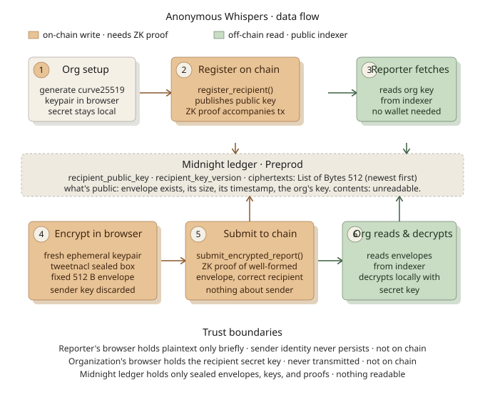

# Anonymous Whispers

[](https://github.com/Emmanuellsensai/anonymous-whispers/actions/workflows/ci.yml)

> Submit an anonymous report on Midnight. Prove you did. Reveal nothing.

## Live Demo

[https://anonymous-whispers.vercel.app](https://anonymous-whispers.vercel.app)

## Contract Address

| Network | Address |
|---------|---------|
| Preprod | `0b24b5da3eaf66860c1b69a6d31f3e86089b5c4af48c2dc4be6f6c5b7f4b34f5` |

Previous address `e64ad6c52fe4fa1a5fa39df58350a722c2d4f9e02d09aaf36c9b9c0d97a22ac9`
ran the pre-Aliit-review circuits. The 2026-08-29 fix (in-circuit
`persistentHash` binding — see `PROGRESS.md`) changed circuit signatures,
so a redeploy was required.

Deployed via the browser at `/deploy` using the 1am wallet, which sponsors
DUST. Lace also works, but requires DUST designation to complete first,
which may take time on a congested Preprod.

Deployment screenshot: `deploy.png`

## Vision

Anonymous Whispers is cryptographic whistleblowing infrastructure for
organizations, built as a reusable Midnight primitive rather than a one-off
app. An organization (a compliance officer, ethics team, ombudsperson, or
board) registers as a recipient by generating a curve25519 keypair in the
browser and publishing only the public half on-chain. Reporters, including
employees, contractors, and customers, encrypt a report to that public key
entirely in their own browser before anything is submitted. The sender's
identity is cryptographically unrecoverable: every submission goes out under
a single-use ephemeral keypair that's discarded immediately after
encryption, so not even the recipient can link two reports to the same
person.

The sample app in this repo (reporter/inbox flows on Midnight Preprod) is the
flagship whistleblowing use case, but the underlying `@anonymous-whispers/sdk`
is deliberately generic: any product needing "many untrusted submitters, one
accountable recipient, content that must stay sealed" fits the same shape,
including consumer complaint channels, government tip lines, grantee
reporting to funders, and journalism source protection.

## Key Features

- Encrypt-to-recipient in the browser (curve25519 / tweetnacl `nacl.box`)
- Fresh throwaway ephemeral sender keypair per message (sender unlinkability)
- 512-byte fixed-shape sealed envelope (no metadata leak via ciphertext size)
- Only the recipient's secret key can decrypt: not us, not Midnight
- Reusable `@anonymous-whispers/sdk` workspace package consumed by the sample app
- Fingerprint verification path for reporters (planned, L5)

## What This Product Does

The problem: private reporting channels need sender identity to be
unrecoverable, not merely "policy-protected." Hosted tip-line SaaS still has
an operator who can log IPs, hold a database, and be subpoenaed or breached;
anonymity there is a promise about behavior, not a property of the system.

Who uses it: organizations subject to whistleblower-protection regimes such
as the EU Whistleblower Directive, SOX, and ISO 37002, plus adjacent cases
like healthcare incident reporting, HR complaint channels, and investigative
journalism source protection.

Why Midnight: zero-knowledge proofs let a reporter prove a submission is
well-formed and correctly encrypted to the currently registered key without
revealing who sent it or what it says, and the ciphertext itself can live
openly in public contract state, auditable by anyone, readable by no one but
the recipient. That combination of public verifiability and selective
disclosure isn't available on a fully transparent chain, where posting even
encrypted blobs from a normal account leaks the transaction graph.

## Architecture



The contract also exposes a legacy `submit_report(content_hash, report_content)`
circuit (one-way hash commitment, no encryption) preserved from Level 1/2 for
backward compatibility; it's not part of the two-way flow diagrammed above.

## Privacy Model

What an observer of the chain can, and cannot, learn.

### What is PUBLIC (on-chain, anyone can read)

- The registered organization's public key (`recipient_public_key`) and its
  version counter (`recipient_key_version`)
- That a report was submitted: a new 512-byte envelope appended to
  `ciphertexts`
- The envelope's exact size (fixed 512 bytes for every report, so size leaks
  nothing)
- A commitment hash of the latest submission (`latest_report_hash`)
- The aggregate submission `counter`
- Rough timing (block inclusion time) and the wallet address that signed the
  transaction

### What is PRIVATE (never on-chain, never transmitted)

- The report contents: encrypted in the browser before anything leaves it;
  plaintext exists only in the reporter's browser pre-encryption and the
  recipient's browser post-decryption
- The reporter's identity as a sender: no persistent sender key exists
  anywhere; a fresh ephemeral keypair is generated per message and discarded
  immediately after encrypting
- Any link between two reports from the same reporter: fresh ephemeral keys
  per submission mean envelopes cannot be correlated to each other
- The recipient's secret key, generated and held client-side only, never
  placed in a transaction, request, or log

### What the reporter PROVES without revealing

- That the submission was correctly formed and disclosed to the ledger via
  the `submit_encrypted_report` circuit
- Nothing about the report's contents or their own identity

`register_recipient` is currently unrestricted in this contract: any caller
can overwrite the registered key, so the version counter exists so
reporters can detect a key change and re-verify out-of-band before trusting
it. Owner-gated registration is scoped to Level 4/5 (see `PROPOSAL.md`).

## Tech Stack

**Contract**: Compact (`pragma language_version >= 0.23`), compiled via the
Compact toolchain installer in CI; `@midnight-ntwrk/compact-runtime` 0.16.0;
local proof server `midnightntwrk/proof-server:8.1.0` (Docker).

**SDK** (`@anonymous-whispers/sdk`): TypeScript, `tweetnacl` for the
crypto core, `@midnight-ntwrk/*` 4.1.1 family (`midnight-js-contracts`,
`midnight-js-indexer-public-data-provider`, `midnight-js-level-private-state-provider`,
`midnight-js-network-id`, `midnight-js-protocol`, `midnight-js-types`,
`midnight-js-utils`), `@midnight-ntwrk/dapp-connector-api` ^4.0.1. Root
`package.json` pins `@midnight-ntwrk/onchain-runtime-v3` to `3.0.0` (and
`ledger-v8` to `8.1.0`, `wallet-sdk` to `1.2.0`) via npm `overrides` to
dedupe conflicting versions across the workspace.

**Frontend**: React 19 with `react-router-dom` 7, Vite 8, TypeScript,
Tailwind CSS 4, Lace or 1am wallet (1am recommended — sponsors DUST out of
the box) via `@midnight-ntwrk/dapp-connector-api`.

## Prerequisites

- Node.js v22+
- Docker (the proof server runs in a container; `contract/docker-compose.yml`)
- Lace or 1am wallet browser extension (1am recommended — sponsors DUST out
  of the box), set to the **Preprod** network
- Preprod tNIGHT from the faucet at
  [https://midnight-tmnight-preprod.nethermind.dev](https://midnight-tmnight-preprod.nethermind.dev)
- Linux (the Compact compiler toolchain used in CI targets Ubuntu; see
  `PROGRESS.md` for the Windows-specific caveat around headless rendering)

## Setup & Run Locally

### 1. Clone and install

```bash
git clone https://github.com/Emmanuellsensai/anonymous-whispers.git
cd anonymous-whispers
npm install
```

### 2. Start the proof server

```bash
cd contract
docker compose up -d proof-server
```

### 3. Compile the contract

```bash
npm run --workspace=contract compile
```

### 4. Run the frontend

```bash
npm run --workspace=frontend dev
```

Open [http://localhost:5173](http://localhost:5173). `/report` is the
reporter view; `/inbox` is the organization view.

## Run Tests

```bash
npm run --workspace=sdk test        # crypto round-trip, unlinkability, envelope shape
npm run --workspace=contract test   # circuit tests plus Level 3 encryption-layer tests
```

## CI/CD

A three-job GitHub Actions pipeline (`.github/workflows/ci.yml`) runs on
push and PR to `main` and `level-4-restructure`:

- `sdk`: `tsc --noEmit` plus vitest
- `frontend`: `tsc --noEmit` plus `vite build` (via the ZK-asset sync step)
- `contract`: install the Compact toolchain, compile, vitest

Live status: see the CI badge above. Deployment is deliberately excluded
from CI: it spends real tDUST and changes the live contract address.

## Usage Guide

See [`docs/USAGE.md`](docs/USAGE.md) for a plain-English, step-by-step guide
for both reporters and organizations.

## Product X Profile

[@AnonymousWhispr](https://x.com/AnonymousWhispr)

## User Feedback

Submitted via: [Anonymous Whispers Feedback Form](https://forms.gle/gC3inyFCvDzYvcq78)

### Onboarded Users (All)

| User ID | User Name | Email | Wallet Address | Feedback Summary |
|---------|-----------|-------|-----------------|-------------------|
| _(none yet, filled in after onboarding)_ | | | | |

### Feedback Implementation (Selected)

| User ID | User Name | Email | Wallet Address | Feedback Summary | Improvements Made | Commit ID |
|---------|-----------|-------|-----------------|-------------------|--------------------|-----------|
| _(none yet, filled in after acting on feedback)_ | | | | | | |

## Future Scope

- Owner-gated `register_recipient` with reporter-visible rotation detection,
  so a legitimate key rotation is distinguishable from a hostile overwrite
  (L4/L5)
- Inbox pagination as submission volume grows (L4)
- Threshold decryption across a board rather than a single recipient key, so
  no individual can read reports alone or be a single point of failure (L5)
- Rate limiting / spam economics for the submission list (L5)
- Fingerprint verification UI so reporters can check the registered key
  against an out-of-band published fingerprint before encrypting (L5)
- Hosted onboarding and a documented escalation path for the case where the
  registered recipient is complicit (L6)
- A second sample app in a different domain (e.g. healthcare incident
  reporting) to prove the SDK is reusable beyond this one product (L6)
- Publish `@anonymous-whispers/sdk` as a standalone npm package (post-L6,
  currently an unpublished workspace package)

## Product Proposal

The full product proposal, including the data disclosure model,
key-verification trust model, and Mainnet feasibility analysis, is in
[PROPOSAL.md](./PROPOSAL.md).

## License

MIT
